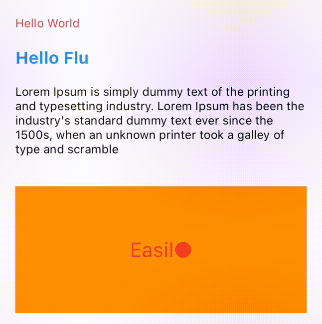

# typewrite_text

[](https://pub.dev/packages/typewrite_text)

A typewriter text animation wrapper with customizations. Supports iOS, Android, web, Windows, macOS, and Linux.

## Motivation

While creating a website for myself, I decided to embellish it with a small yet striking text animation to give it extra allure. This little detail not only added beauty to my site but also brought dynamism, making it stand out among others. While there **are** some packages that offer almost what I need, they **weren't quite sufficient** for my vision.

## Features

- Allows to set up different delays for forward and reverse animation.
- Allows to set up different delays before animation starts and after animation ends.
- Can be used just in "forward" mode.
- Can be used with or without animated text cursor.
- Allows to set up text theme.

## Getting started

TODO: List prerequisites and provide or point to information on how to
start using the package.

## Usage

Basic animation. Just add text line(s) and specify text theme:

```dart
TypewriteText(
  linesOfText: ['Hello World', 'Hello Flutter', 'Hello Dart'],
  textStyle: TextStyle(color: Colors.red),
),
```

One side animation without showing animated text cursor:

```dart
TypewriteText(
  linesOfText: ['Hello World', 'Hello Flutter', 'Hello Dart'],
  textStyle: TextStyle(color: Colors.blue, fontSize: 20, fontWeight: FontWeight.bold),
  reverseAnimationDuration: Duration.zero,
  beforeAnimationDuration: Duration.zero,
  needCursor: false,
)
```

{ width: 500px; }

## Documentation

| Property                 | Purpose                                         |
|--------------------------|-------------------------------------------------|
| **linesOfText**          | List of strings to be shown.                    |
| **textStyle**            | TextStyle for this strings.                     |
| forwardAnimationDuration | The rate of a symbol appears                    |
| reverseAnimationDuration | The rate of a symbol vanishes.                  |
| beforeAnimationDuration  | The interval before the symbols' initial appearance. |
| afterAnimationDuration   | The pause following the display of all symbols. |
| needCursor               | If you need an animated cursor, set `true` otherwise - `false`. |
| cursorColor              | Color of the animated text cursor.              |
